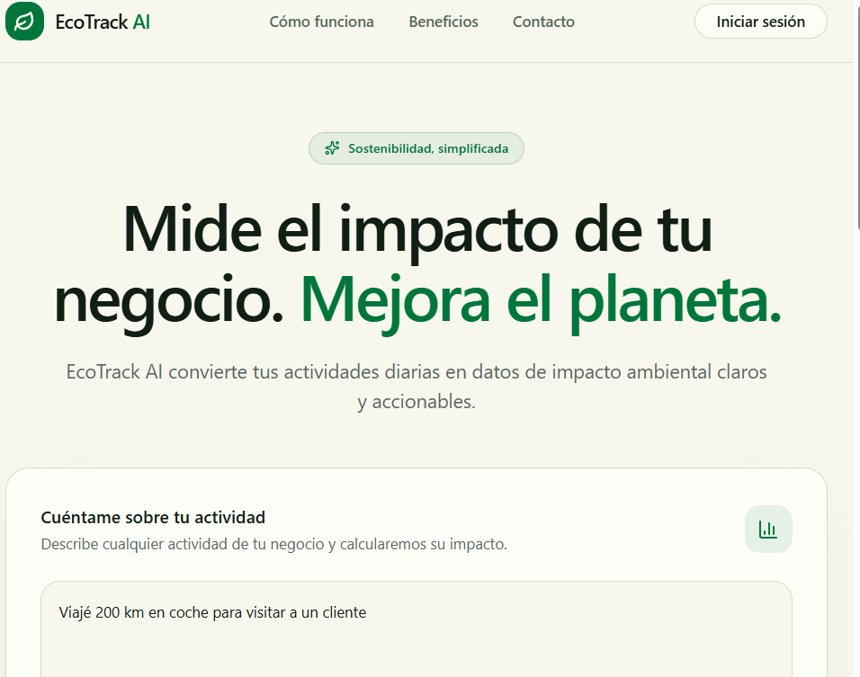
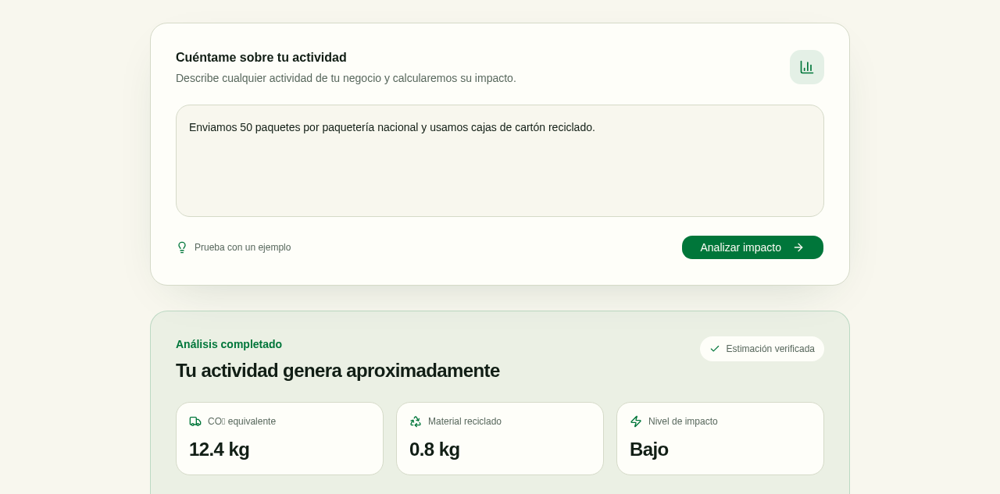
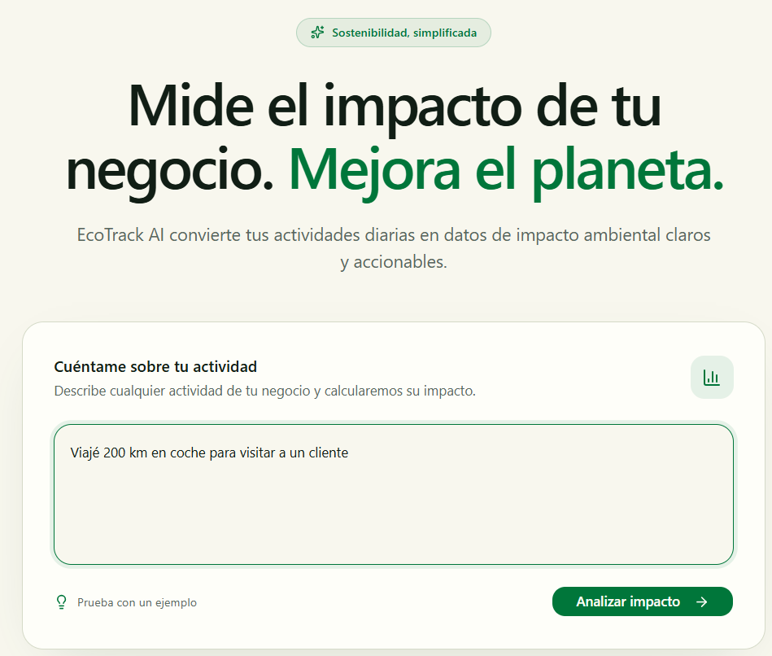
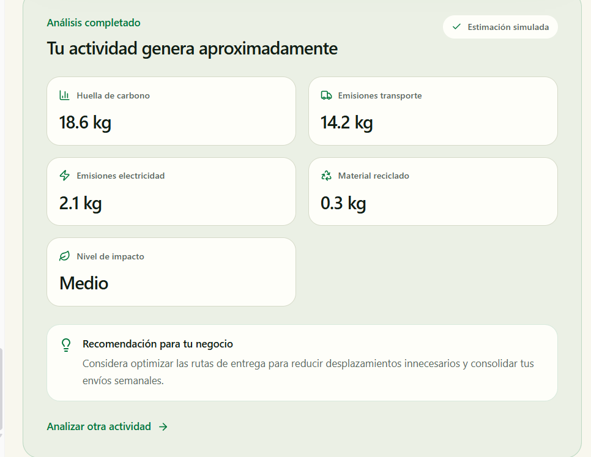
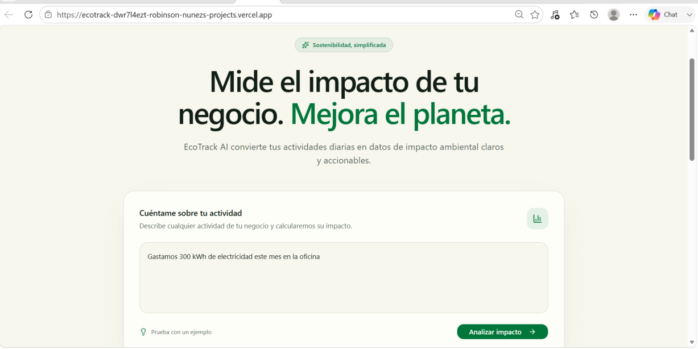
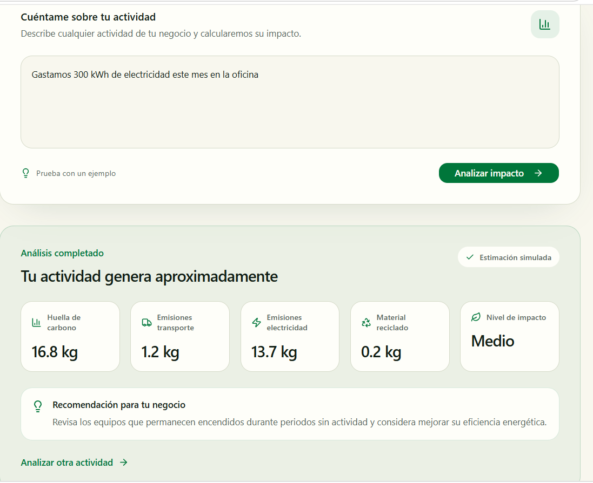
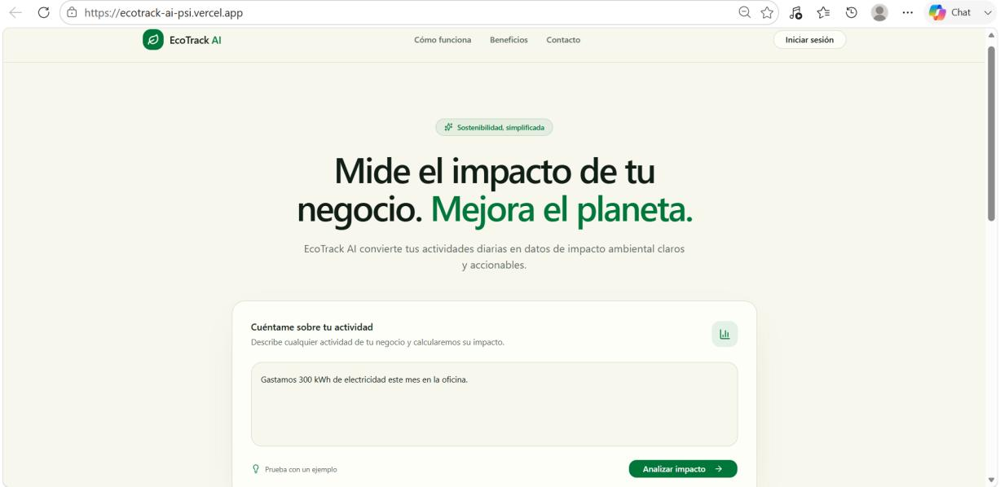
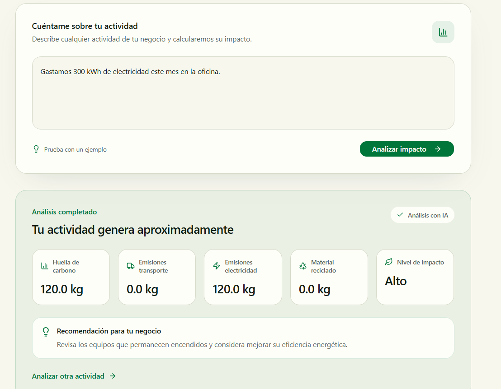

# Bitácora del Proyecto — EcoTrack AI

**Proyecto Integrador Capstone:** *"De la Idea a la Realidad con Vibe Coding"*
**Herramienta principal utilizada:** [v0.dev](https://v0.dev) (Vercel)
**Proveedor de IA:** Groq (capa gratuita)
**Repositorio:** `https://github.com/Robinson677/ecotrack-ai`
**Proyecto en producción:** `https://ecotrack-ai-psi.vercel.app`

---

## 1. Escenario del caso de estudio

La startup **EcoTrack AI** necesita un MVP para una aplicación web que ayude a pequeños negocios a calcular su huella de carbono de forma simplificada. En vez de formularios complejos, los usuarios describen sus actividades diarias en lenguaje natural (ej: *"Hoy usamos 5 camionetas de reparto y gastamos 200 kWh de luz"*) y reciben un análisis inmediato.

## 2. Por qué v0

Se decidió trabajar con **v0.dev** en lugar de Cursor o Replit Agent porque estas últimas agotaban rápidamente el límite de tokens disponible, mientras que v0 permitió iterar con mayor margen durante todo el desarrollo del MVP.

## 3. Flujo de trabajo seguido

```
Crear repo en GitHub → Crear proyecto en v0 → Generar MVP (Master Prompt)
→ Iterar diseño → Agregar funcionalidad de IA real → Depurar errores
→ Desplegar en Vercel → Documentar en esta bitácora
```

---

## 4. Prompts principales

Cada prompt sigue la estructura **Rol → Tarea → Contexto → Formato → Restricciones (→ Ejemplos)**.

### Prompt 1 — Master Prompt (generación inicial del MVP)

```
Quiero construir un MVP llamado EcoTrack AI, una aplicación web para pequeños
negocios que permita estimar su huella de carbono de una manera sencilla.

Contexto del producto
Los dueños de pequeños negocios normalmente no tienen tiempo para completar
formularios ambientales complejos. EcoTrack AI debe permitirles describir sus
actividades cotidianas utilizando lenguaje natural.

Por ejemplo:
"Hoy usamos 5 camionetas de reparto durante 80 km y gastamos 200 kWh de
electricidad."

En futuras iteraciones agregaremos una funcionalidad de inteligencia
artificial que interpretará este texto y extraerá automáticamente los datos
necesarios para calcular las emisiones.

Objetivo de esta primera versión
Construir principalmente la interfaz y la estructura inicial de la
aplicación. NO integrar todavía ninguna API externa de IA, base de datos,
autenticación ni sistema de usuarios. Utilizar datos simulados.

Interfaz principal
- Logo y nombre "EcoTrack AI"
- Frase corta que explique el propósito
- Interfaz principal tipo asistente/chat con área de texto grande
- Botón principal "Analizar actividad"
- Ejemplo de actividad como guía
- Sección de resultados: huella de carbono, emisiones por transporte,
  emisiones por electricidad, recomendación de sostenibilidad
- Sección "¿Cómo funciona?" con 3 pasos

Diseño visual
Moderno, minimalista y profesional (SaaS real, no proyecto escolar). Verde
como color de acento, blanco, grises neutros. Tarjetas redondeadas, bordes
sutiles, sombras suaves, tipografía moderna, diseño responsive. Evitar
degradados excesivos, animaciones innecesarias, interfaces infantiles.

Tecnologías
Next.js, React, TypeScript, Tailwind CSS, shadcn/ui. Separar la interfaz de
la lógica de negocio para poder agregar después NLP con IA, cálculo de
emisiones, validación y recomendaciones. No agregar autenticación, base de
datos, pagos ni APIs externas todavía.
```

**Resultado:** primera versión del dashboard con branding, campo de descripción de actividad, resultados con datos simulados marcados como *"Estimación verificada"*.

📸 **Evidencia 1 — Primera generación del MVP**





---

### Prompt 2 — Iteración de UX y flujo de análisis

```
Rol: Eres un desarrollador frontend senior especializado en UX para
productos SaaS.

Tarea: Mejorar el flujo de análisis de EcoTrack AI para que se sienta como
un asistente inteligente real: escribir → analizar → mostrar resultados →
recomendación.

Contexto: La v1 mostraba los resultados de forma instantánea y estática, y
etiquetaba los datos simulados como "Estimación verificada", lo cual induce
a pensar que la información es real cuando todavía no lo es.

Formato de los cambios:
1. Mostrar un estado de carga breve después de presionar "Analizar impacto".
2. Cambiar la etiqueta "Estimación verificada" por "Estimación simulada".
3. Ampliar las métricas mostradas: huella de carbono, emisiones de
   transporte, emisiones de electricidad, material reciclado, nivel de
   impacto.
4. Después de las métricas, mostrar una "Recomendación para tu negocio"
   relacionada con la actividad ingresada (transporte → optimizar rutas;
   electricidad → eficiencia energética).
5. Mostrar un mensaje amigable cuando no exista ningún análisis todavía.
   Agregar botón secundario "Analizar otra actividad".
6. Conservar el diseño actual (verde, fondo claro, tarjetas redondeadas,
   sombras suaves, responsive). No rediseñar por completo.
7. Organizar el código separando entrada del usuario, proceso de análisis,
   resultados y recomendaciones, para poder reemplazar después los datos
   simulados por IA real.

Restricciones: No agregar todavía API externa de IA, base de datos,
autenticación ni pagos. Verificar que el proyecto compile sin errores.
```

**Prueba realizada:** *"Viajé 200 km en coche para visitar a un cliente."*
**Resultado:** loading visible, resultados con emisiones de transporte, recomendación coherente sobre optimizar rutas de entrega, etiqueta *"Estimación simulada"*.

📸 **Evidencia 2 — Prueba e iteración**





---

### Prompt 3 — Integración de IA real (extracción de datos con NLP)

```
Rol: Eres un desarrollador full-stack senior experto en Next.js, TypeScript
y en la integración de modelos de lenguaje mediante el AI SDK de Vercel.

Tarea: Reemplazar el análisis simulado por un análisis real: un modelo de
IA debe extraer automáticamente los datos relevantes del texto del usuario
(kilómetros recorridos, tipo de transporte, kWh de electricidad), y nuestro
propio código debe calcular las emisiones a partir de esos datos. La IA
solo extrae datos, no calcula ni inventa las emisiones directamente.

Contexto: EcoTrack AI es un MVP que estima la huella de carbono a partir de
una descripción en lenguaje natural. El análisis simulado ya está separado
en lib/eco-analysis.ts. Ya existe una cuenta de Groq configurada, y la
variable de entorno GROQ_API_KEY ya está disponible en el proyecto de
Vercel conectado a v0.

Formato de la implementación:
1. Usar el AI SDK de Vercel (ai + @ai-sdk/groq) con el modelo
   llama-3.1-8b-instant.
2. Crear una función server-side (Server Action o Route Handler) que reciba
   el texto del usuario y use generateObject con un schema de Zod:
   { km_recorridos: number, tipo_transporte: string | null,
     kwh_electricidad: number, resumen_actividad: string }
3. En el frontend, al presionar "Analizar impacto", llamar a esta función
   en lugar de generar datos aleatorios.
4. Calcular las emisiones en lib/eco-analysis.ts usando factores de
   emisión estándar (0.12 kg CO2 por km en coche, 0.4 kg CO2 por kWh).
5. Cambiar la etiqueta "Estimación simulada" por "Análisis con IA".

Restricciones: Si el texto no menciona algún dato, ese campo debe quedar en
0 o null, nunca inventado. No cambiar el diseño visual. Mantener el estado
de carga y agregar manejo de errores amigable. No agregar autenticación,
base de datos ni pagos.

Ejemplo de entrada/salida esperada:
- Entrada: "Viajé 200 km en coche para visitar a un cliente."
- Salida del modelo: { "km_recorridos": 200, "tipo_transporte": "coche",
  "kwh_electricidad": 0, "resumen_actividad": "Viaje en coche para visita
  a cliente" }
- Resultado esperado en pantalla: ≈24 kg CO2 de transporte.
```

**Implementación generada por v0:**
- Ruta server-side `app/api/analyze/route.ts`
- Extracción estructurada con Zod mediante el AI SDK
- Cálculo local de emisiones en `lib/eco-analysis.ts` (0.12 kg CO₂/km transporte, 0.4 kg CO₂/kWh electricidad)
- Estados de carga y manejo de errores amigable
- Etiqueta actualizada a *"Análisis con IA"*

---

## 5. Resolución de problemas (Debugging con IA)

Durante la integración de la IA se presentaron **dos errores técnicos reales**, ambos resueltos dirigiendo a v0 mediante lenguaje natural, sin escribir código manualmente.

### Error 1 — Llamadas bloqueadas por el AI Gateway de Vercel

**Síntoma:** v0 implementó la IA usando el *AI Gateway* de Vercel (un intermediario que enruta a distintos modelos), el cual exige tener una tarjeta registrada para habilitar créditos, aunque el modelo en sí sea gratuito.

**Diagnóstico:** v0 mismo reportó en su respuesta que la prueba llegó al AI Gateway pero fue rechazada por falta de *billing* habilitado.

**Prompt de corrección:**
```
Rol: Eres un desarrollador full-stack senior experto en el AI SDK de
Vercel.

Tarea: La implementación actual pasa las llamadas de IA por el AI Gateway
de Vercel, el cual requiere billing habilitado. Corregirlo para llamar
directamente a la API de Groq usando nuestra propia API key, sin pasar por
el Gateway.

Contexto: Ya existe la variable de entorno GROQ_API_KEY configurada en el
proyecto de Vercel. Se quiere usar el proveedor @ai-sdk/groq de forma
directa (no ai-gateway).

Formato: Importar createGroq desde @ai-sdk/groq y configurarlo
explícitamente con apiKey: process.env.GROQ_API_KEY. Mantener el resto de
la lógica (schema de Zod, generateObject, cálculo de emisiones) exactamente
igual.

Restricciones: No usar el AI Gateway de Vercel. No cambiar el diseño
visual.
```

**Resultado:** v0 instaló el proveedor `@ai-sdk/groq`, reemplazó la llamada por `createGroq({ apiKey: process.env.GROQ_API_KEY })` y eliminó por completo el uso del AI Gateway. Build de producción correcto.

📸 **Prueba durante la depuración** (aún mostraba "Estimación simulada" mientras se ajustaba el proveedor de IA):





---

### Error 2 — Modelo de Groq deprecado (`model_not_found`)

**Síntoma:** al probar en producción, la aplicación devolvía un error 500 con el mensaje *"No pudimos analizar la actividad"*.

**Diagnóstico:** se revisaron los *Runtime Logs* del proyecto en Vercel, donde apareció el error exacto:

```
Error [AI_APICallError]: The model `llama-3.1-8b-instant` does not exist
or you do not have access to it.
statusCode: 404
responseBody: {"error":{"message":"The model `llama-3.1-8b-instant` does
not exist or you do not have access to it.","type":"invalid_request_error",
"code":"model_not_found"}}
```

Investigando la causa, se confirmó que **Groq deprecó sus modelos Llama de chat** (`llama-3.3-70b-versatile` y `llama-3.1-8b-instant`), recomendando usar `openai/gpt-oss-120b` o `openai/gpt-oss-20b` para tareas de propósito general.

**Prompt de corrección:**
```
Rol: Eres un desarrollador full-stack senior experto en el AI SDK de
Vercel y en la API de Groq.

Tarea: La llamada a la API de Groq falla con "model_not_found" porque el
modelo llama-3.1-8b-instant fue deprecado. Actualizar la implementación
para usar el modelo vigente openai/gpt-oss-20b.

Contexto: La ruta app/api/analyze/route.ts usa @ai-sdk/groq con
createGroq({ apiKey: process.env.GROQ_API_KEY }) y generateObject con un
schema de Zod. El único cambio necesario es el identificador del modelo.

Formato: Reemplazar toda referencia a llama-3.1-8b-instant por
openai/gpt-oss-20b. No cambiar el schema de Zod, el cálculo de emisiones ni
el diseño visual. Verificar que el build compile sin errores.

Restricciones: Mantener el resto del código exactamente igual. No agregar
dependencias innecesarias.
```

**Resultado:** tras publicar el cambio y volver a probar en producción con la actividad *"Gastamos 300 kWh de electricidad este mes en la oficina"*, el sistema devolvió correctamente **120.0 kg de emisiones de electricidad** (300 kWh × 0.4), con la etiqueta **"Análisis con IA"** — confirmando que el análisis ya es real y no simulado.

📸 **Resultado final tras la corrección — Análisis con IA funcionando en producción:**





---

## 6. Funcionalidad de IA implementada

EcoTrack AI usa **procesamiento de lenguaje natural (NLP)** para resolver el problema central del usuario: evitar formularios complejos.

- El usuario describe su actividad en texto libre.
- Un modelo de Groq (`openai/gpt-oss-20b`), a través del AI SDK de Vercel, **extrae datos estructurados** (km recorridos, tipo de transporte, kWh de electricidad) usando un schema de Zod con `generateObject`.
- El cálculo de emisiones lo realiza **código propio** (no la IA), aplicando factores de emisión estándar — separación intencional entre "extracción de datos" (IA) y "lógica de negocio" (determinística), para evitar que el modelo invente cifras.
- El resultado se muestra con la etiqueta *"Análisis con IA"* para distinguirlo claramente de los datos simulados de las primeras iteraciones.

## 7. Cómo la Vibe Coding aceleró el desarrollo

Todo el ciclo — desde la primera pantalla hasta la integración de IA real en producción, incluyendo dos rondas de debugging — se completó en una sola sesión de trabajo, sin escribir una sola línea de código manualmente. En un flujo tradicional, esto habría implicado: configurar manualmente un proyecto Next.js, instalar y aprender la API del AI SDK, escribir y depurar el componente de UI, y diagnosticar errores de integración por prueba y error. Con Vibe Coding, el trabajo se concentró en **dirigir con precisión** (prompts estructurados con rol, tarea, contexto, formato y restricciones) y en **evaluar críticamente** cada resultado — incluyendo detectar cuándo el propio v0 tomaba una decisión técnica subóptima (usar el AI Gateway) y corregirla con una instrucción específica.

---

## 8. Entregables

- ✅ Repositorio: `https://github.com/Robinson677/ecotrack-ai`
- ✅ Proyecto vivo: `https://ecotrack-ai-psi.vercel.app`
- ✅ Esta bitácora (prompts, capturas, funcionalidad de IA, debugging)
- ⬜ Video demo (opcional)

## 9. Capturas de evidencia

| # | Archivo | Descripción |
|---|---------|-------------|
| 1 | `images/01-v1-hero-input.png` | v1 — pantalla principal y campo de entrada |
| 2 | `images/02-v1-resultado-simulado.png` | v1 — resultado con "Estimación verificada" |
| 3 | `images/03-v2-input.png` | v2 — prueba con "Viajé 200 km en coche..." |
| 4 | `images/04-v2-resultado-estimacion-simulada.png` | v2 — resultado con recomendación dinámica, etiqueta "Estimación simulada" |
| 5 | `images/05-ia-input-electricidad.png` | Prueba de IA — entrada "300 kWh de electricidad" |
| 6 | `images/06-ia-resultado-error-modelo-deprecado.png` | Resultado aún simulado, previo a detectar el error del modelo deprecado |
| 7 | `images/07-correccion-input.jpg` | Corrección — nueva prueba en producción tras el fix |
| 8 | `images/08-correccion-resultado-analisis-con-ia.png` | Resultado final: 120 kg CO₂ calculados con IA real, etiqueta "Análisis con IA" |